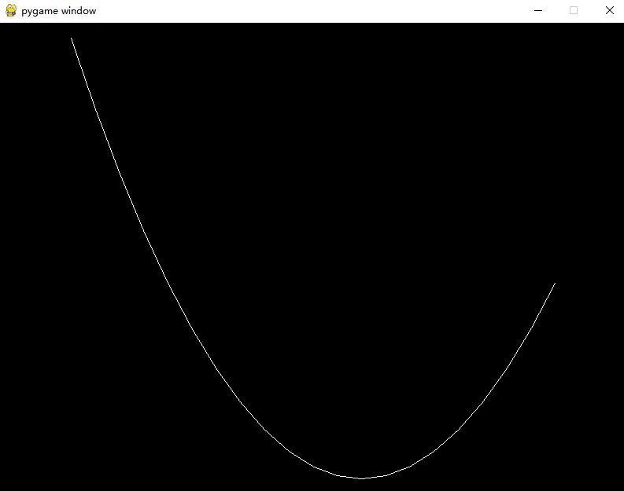
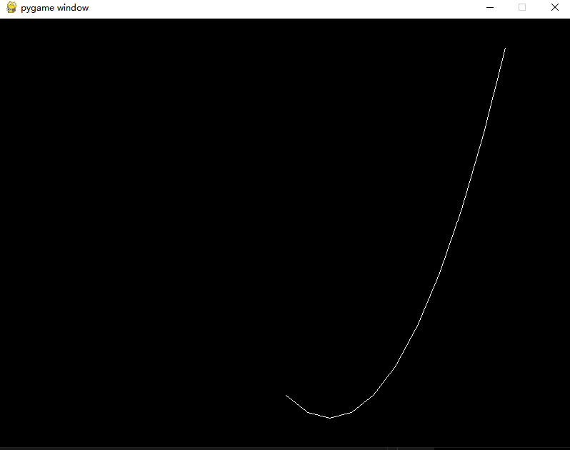
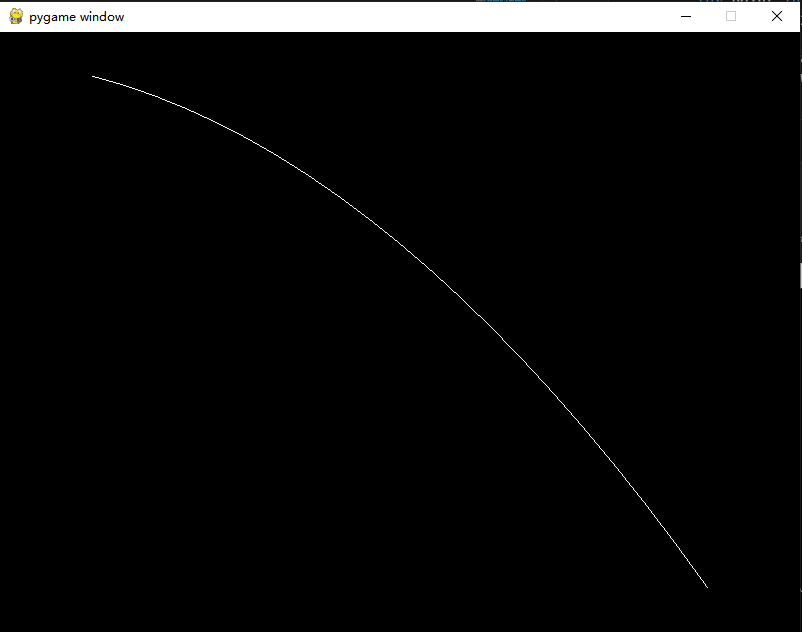

# Homework 1
*Weiji Xie @ 2025/03/15*

We implement an incremental algorithm based on second-order difference for drawing a quadratic polynomial, using Python and OpenGL for rendering.

## Algorithm

### Math form

The quadratic polynomial is given by:  
$y = ax^2 + bx + c$  

To compute $y$ incrementally, we can use the following approach:  

1. Initial Value:  
   - Compute the initial value of $y$ at $x = x_{\text{start}}$:  
     $y_0 = a \cdot x_{\text{start}}^2 + b \cdot x_{\text{start}} + c$  


2. Incremental Update:  
   - Compute the change in $y$ as $x$ increases by 1:  
     $\Delta y = y_{i+1} - y_i = a(x+1)^2 + b(x+1) + c - (ax^2 + bx + c)$  
     Simplifying:  
     $\Delta y = 2a x + a + b$  
   - Further, the change in $\Delta y$ (second derivative) is constant:  
     $\Delta (\Delta y) = 2a$  

3. Algorithm Steps:  
   - Initialize $y$, $\Delta y$, and $\Delta (\Delta y)$.  
   - For each step, update $y$ using $\Delta y$, and update $\Delta y$ using $\Delta (\Delta y)$.


### Pseudocode
```
1. Initialize:
   - x = x_start
   - y = a * x^2 + b * x + c
   - delta = 2 * a * x + b
   - delta_change = 2 * a

2. Loop until x > x_end:
   - Store (x, y)
   - y += delta
   - delta += delta_change
   - x += 1
```

## Implementation

### Code
The implementation uses **Python** with **PyOpenGL** for rendering. The key function `draw_quadratic` computes the points of the polynomial incrementally.

```python
import pygame
from pygame.locals import *
from OpenGL.GL import *
from OpenGL.GLU import *

def draw_quadratic(a, b, c, x_start, x_end):
    if x_start > x_end:
        x_start, x_end = x_end, x_start
    
    # Initial calculations
    x = x_start
    y = a * x**2 + b * x + c  # Starting point (only multiplication here)
    
    # Calculate initial delta and delta change
    delta = 2 * a * x + b
    delta_change = 2 * a
    
    # Store points for drawing
    points = []
    
    while x <= x_end:
        points.append((x, y))
        # Update y using incremental approach (no multiplication)
        y += delta
        delta += delta_change
        x += 1
    
    return points

def main():
    # Polynomial coefficients
    a = 1
    b = -3
    c = 2
    
    # Range of x values
    x_start = -10
    x_end = 10
    
    # Generate points using incremental algorithm
    points = draw_quadratic(a, b, c, x_start, x_end)
    
    # Set up pygame and OpenGL
    pygame.init()
    display = (800, 600)
    pygame.display.set_mode(display, DOUBLEBUF | OPENGL)
    gluOrtho2D(-13, 13, min(points, key=lambda x: x[1])[1] - 5, max(points, key=lambda x: x[1])[1] + 5)
    
    while True:
        for event in pygame.event.get():
            if event.type == pygame.QUIT:
                pygame.quit()
                quit()
        
        glClear(GL_COLOR_BUFFER_BIT | GL_DEPTH_BUFFER_BIT)
        glBegin(GL_LINE_STRIP)
        for point in points:
            glVertex2f(point[0], point[1])
        glEnd()
        pygame.display.flip()
        pygame.time.wait(10)

if __name__ == "__main__":
    main()
```

### Result

($a=1,b=-3,c=2,x_{start}=-10,x_{end}=10$)




($a=1,b=-3,c=2,x_{start}=0,x_{end}=10$)



($a=-0.1,b=-3,c=2,x_{start}=-10,x_{end}=10$)

