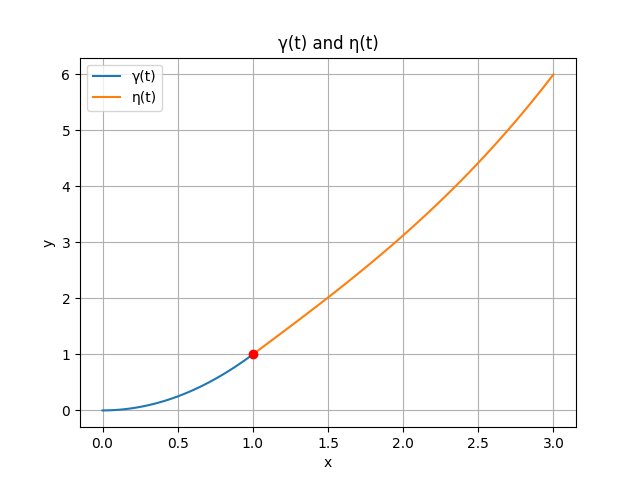
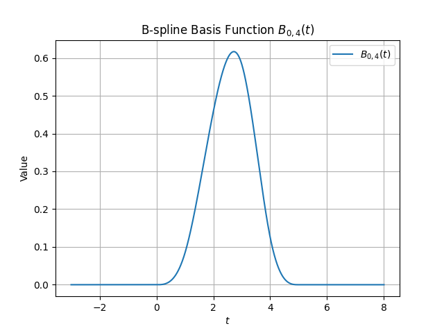
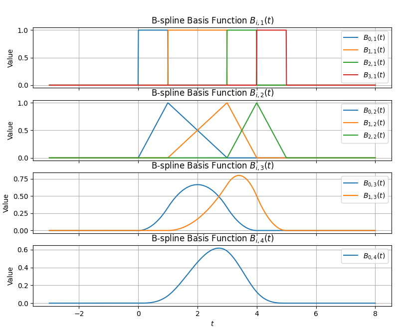

# Homework 3
*Weiji Xie @ 2025/04/12*

## Task 1

### Plot
The result image is shown below:

### Answer

$$
\gamma(t) = (t,t^2) \\
\frac{d\gamma}{dt} = (1,2t)\\
% \frac{d\gamma}{dt}(0) = (1,0)\\
\frac{d\gamma}{dt}(1) = (1,2)\\
\\
\eta(t) = (2t+1,t^3+4t+1)\\
\frac{d\eta}{dt} = (2,3t^2+4)\\
\frac{d\eta}{dt}(0) = (2,4)\\
% \frac{d\eta}{dt}(1) = (2,7)\\
$$

C1 continuity: Notice that the derivative of $\gamma^\prime(t=1)$ and $\eta^\prime(t=0)$ are not equal, so $\gamma(t)$ and $\eta(t)$ are not C1 continuous at $t=1$.

G1 continuity: Notice that the derivative of $\gamma^\prime(t=1)$ and $\eta^\prime(t=0)$ have the same direction, so $\gamma(t)$ and $\eta(t)$ are G1 continuous at $t=1$.

## Task 2

### Calculation

By definition:
$$
B_{0,1}(t) = \mathbb{1}[0 \leq t < 1] \\
B_{1,1}(t) = \mathbb{1}[1 \leq t < 3] \\
B_{2,1}(t) = \mathbb{1}[3 \leq t < 4] \\
B_{3,1}(t) = \mathbb{1}[4 \leq t < 5] \\

B_{0,2}(t) = \frac{t}{1}B_{0,1}(t) + \frac{3-t}{2}B_{1,1}(t) \\
B_{1,2}(t) = \frac{t-1}{2}B_{1,1}(t) + \frac{4-t}{1}B_{2,1}(t) \\
B_{2,2}(t) = \frac{t-3}{1}B_{2,1}(t) + \frac{5-t}{1}B_{3,1}(t) \\

B_{0,3}(t) = \frac{t}{3}B_{0,2}(t) + \frac{4-t}{3}B_{1,2}(t) \\
B_{1,3}(t) = \frac{t-1}{3}B_{1,2}(t) + \frac{5-t}{2}B_{2,2}(t) \\

B_{0,4}(t) = \frac{t}{4}B_{0,3}(t) + \frac{5-t}{4}B_{1,3}(t)\\
$$

The result is shown below:

$$
B_{0,2}(t) = 
\begin{cases} 
t, & 0 \leq t < 1 \\
\frac{3 - t}{2}, & 1 \leq t < 3 \\
0, & \text{其他}
\end{cases}
$$

$$
B_{1,2}(t) = 
\begin{cases} 
\frac{t - 1}{2}, & 1 \leq t < 3 \\
4 - t, & 3 \leq t < 4 \\
0, & \text{其他}
\end{cases}
$$

$$
B_{2,2}(t) = 
\begin{cases} 
t - 3, & 3 \leq t < 4 \\
5 - t, & 4 \leq t < 5 \\
0, & \text{其他}
\end{cases}
$$

$$
B_{0,3}(t) = 
\begin{cases} 
\frac{t^2}{3}, & 0 \leq t < 1 \\
\frac{t(3 - t) + (4 - t)(t - 1)}{6}, & 1 \leq t < 3 \\
\frac{(4 - t)^2}{3}, & 3 \leq t < 4 \\
0, & \text{其他}
\end{cases}
$$

$$
B_{1,3}(t) = 
\begin{cases} 
\frac{(t - 1)^2}{6}, & 1 \leq t < 3 \\
\frac{(t - 1)(4 - t)}{3} + \frac{(5 - t)(t - 3)}{2}, & 3 \leq t < 4 \\
\frac{(5 - t)^2}{2}, & 4 \leq t < 5 \\
0, & \text{其他}
\end{cases}
$$

$$
B_{0,4}(t) = 
\begin{cases} 
\frac{t^3}{12}, & 0 \leq t < 1 \\
\frac{t}{4} \left( \frac{t(3 - t) + (4 - t)(t - 1)}{6} \right) + \frac{5 - t}{4} \left( \frac{(t - 1)^2}{6} \right), & 1 \leq t < 3 \\
\frac{t}{4} \left( \frac{(4 - t)^2}{3} \right) + \frac{5 - t}{4} \left( \frac{(t - 1)(4 - t)}{3} + \frac{(5 - t)(t - 3)}{2} \right), & 3 \leq t < 4 \\
\frac{(5 - t)^3}{8}, & 4 \leq t < 5 \\
0, & \text{其他}
\end{cases}
$$

### Plot

